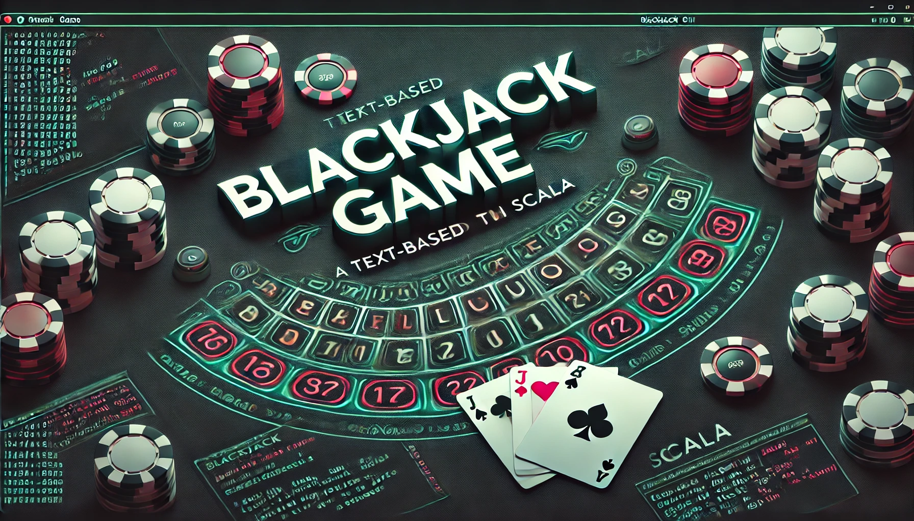

---

# Blackjack

Blackjack is a text-based Blackjack game built with Scala. This game provides a command-line interface (TUI) where users can interactively play Blackjack by entering commands.

---

## Features

* **Add Players**: Add multiple players to the game before starting.
* **Game Actions**: Hit, Stand, Restart, and Start a new game.
* **Console Colorization**: Outputs are colorized for better readability.
* **Exit Option**: Exits the game safely.

---

## Getting Started

### Prerequisites

* Scala installed

### Running the Game

1. Clone the repository.
2. Compile the code with `scalac`.
3. Run the application with `scala`.

### Using the TUI

Once the game is running, you can control the flow using the following commands:

* **help**: Displays a help message with available commands (TODO).
* **add [name]**: Adds a new player to the game with the specified name.
* **start**: Starts a new game round.
* **hit**: Draws another card for the current player.
* **stand**: Ends the current player's turn.
* **restart**: Restarts the game with the current players.
* **printHands**: Displays each player’s hand and total score.
* **exit**: Exits the game.

### Command Examples

* `add Alice` - Adds a player named Alice.
* `start` - Begins the Blackjack game with all added players.
* `hit` - The current player draws a card.
* `stand` - The current player ends their turn.
* `printHands` - Shows each player’s hand.
* `exit` - Exits the game.

---

## Game Overview

Blackjack is a card game where players try to reach a total score of 21 without going over. The player can choose to draw cards ("hit") or stop drawing ("stand"). The player closest to 21 at the end of the round wins, unless the dealer has a better score.

---

## Code Structure

* **view.Tui**: Manages the user interface and input processing.
* **model.Game**: Represents the game state and handles logic for player actions and game rules.
* **model.GameState**: Enum for game states, including EXIT.
* **view.ConsoleColors**: Provides colorization for text output.

---

## Future Work

* **Help Command**: Expand the `help` command to show detailed command usage.
* **Game Rules**: Implement more Blackjack rules, such as splitting and doubling down.

---

## License

This project is licensed under the MIT License.
